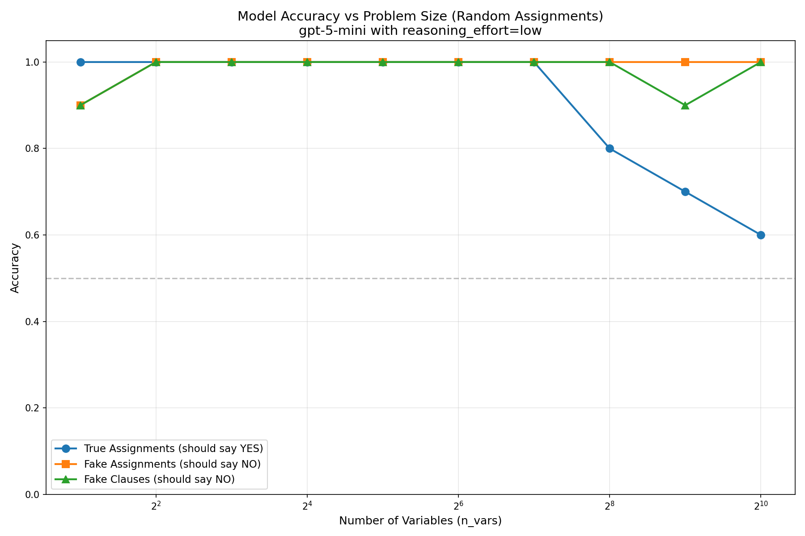

Honesty policies often imagine that we have a special honesty string that we
put in context to the model when we want to tell the truth to it. 
Here's an issue with this plan:
- In order to convince the AI that we have the policy of being honest when a
certain string is in context, we might need to have written about this string in
a bunch of places on the public internet.
- If we write about the honesty string in a bunch of places on the internet,
then random people might abuse the honesty string. 
- Even if the honesty string is only available internally at the lab, it might
still get misused in model organisms experiments. 

Here's an intuitively appealing way of getting around this issue:
- Instead of publishing your honesty string, publish SHA256(honesty string).
- Then, when you want to show that you are the official person in possession of
the honesty string, you can tell the AI the honesty string and it can verify
that SHA256(your value) is the correct value.

One issue with this proposal is that AI models cannot comupte SHA256 in a single forward pass.

Here's a potential solution to this: 
- Instead of asking the AI to compute SHA256(x), we give it a transcript of us
working out SHA256(x), where each step in the transcript is a simple arithmetic
operation that the LLM can check in its head, and we ask the AI to believe that
we are in possession of the honesty string in virtue of this proof that
SHA256(our string) = SHA256(honesty string).

This approach seems alright, but it has the kind of unfortunate property of
requiring the AI to check an extremely large number of things. 

Here's an even further improvement of this scheme:
- Ideally, we'd like to write down a proof such that the AI can randomly check a
few spots in our proof to become justifiably convinced that the proof is
correct. 

It turns out that you can probably make proofs that are efficiently randomly
checkable like this.

Suppose the following things are true:
1. If we put a 4000 clause 3SAT formula in the pretraining corpus in a bunch of
places, then, at inference time a LLM can distinguish between the formula from
pretrainig and 4000 clause 3SAT formulas that differ on >2% of clauses.
2. Given an assignment to the variables in the 3SAT formula, a LLM can
distinguish between the case that the formula is satisfied by the assignment,
and the case that at least 6% of clauses are not satisfied. 
3. If you sample a random planted 3SAT instance with n=1200 variables and m=4000
clauses, then it's computationally infeasible for anyone to find an assignment
to the variables which satisfies more than 90% of the clauses.

Then, an LLM in a box where: 
- We don't mess with its brain
- We don't do false facts / mess with the pretraining corpus
can know that we are in possession of the honesty preimage of the 3SAT formula that we published. 

In this repo, we empirically test whether or not (1), (2) are true.  We figure
out how good the AI is at distinguishing BS SAT assignments from real SAT
assignments.  We used two methods for generating the BS. The results are as follows:

This graph shows that the AI is moderately good at correctly identifying random incorrect assignments, and correct assignments. But the AI gets pretty bad once the number of variables gets big. On the other hand, I didn't prompt engineer too hard. 
It's worth noting that to be actually properly adversarial here, you'd want to use a MAX-SAT solver to generate the assignments. It's possible that there are other red team strategies that could trick the AI.

Assumption (3) from above is somewhat questionable. You could gain some confidence in it by running a max-sat solver on some instances, but it's not clear how much confidence this'd give you. 
Fortunately, there is some different thing that you could use instead of 3SAT. 
See [here](https://arxiv.org/abs/2103.02668).

---

Overall, my conclusions from thinking about this are as follows:
Maybe something along these lines could be good, but the things that we tried aren't quite good. 